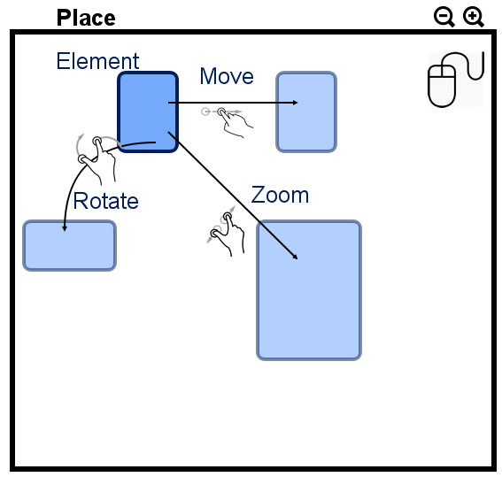
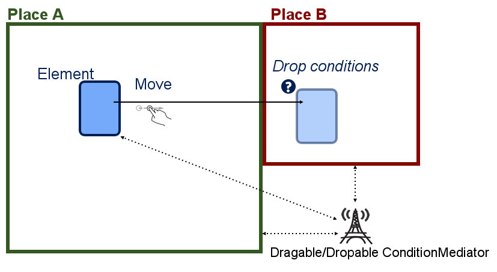

rc-movable
====

High level Angular directives for element drag and drop in a transformable scene, mobile first.
The Touch events are using the light [Hammer.js](https://hammerjs.github.io/) dependency.


v 0.0.1 : simply DO NOT USE !!!!!
===

OK, I want to check for fun or contribute
====

## Install

Install with bower:

```bash
bower install rc-movable
```

Usage
===

Include ``rc-movable.js`` in your HTML




        <!-- create a Place where you can drag from -->
        <div rc-place="Capitole">

            <!-- create an element that will move inside the Place -->
            <div rc-movable>...</div>

        </div>


## Single place Features

* The Place can scale, rotate and move (if set to transformable, or independantly movable, zoomable or *rotationable*)
* The Place can't move if not scaled in (with default option)


Exemple

        <!-- The Capitole can move, rotate and/or zoom in/out -->
        <div rc-place="capitole" rc-transformable>

        </div>

Exemple of only zoomable

        <!-- The Capitole can't move neither rotate but can zoom in (can't be smaller than inital size) -->
        <div rc-place="capitole" rc-zoomable="in">


        </div>


## Movable Element Feature

* The Element can move, but not rotate/scale (it would be awful for little elements)
* The Element has a 'moving' css class while moving
* The Element can go outside its place
* Places inside Places are not supported yet

        <!-- create a Place where you can drag from -->
        <div rc-place>

            <!-- create an element that will move inside the Place -->
            <div rc-movable="nolimit">...</div>

        </div>

An element needs a Place to move

        <!-- Without Place, the element may move, but no guarantee on anything -->
        <div rc-movable>...</div>

## Drag and Drop Features



* The element has a  'dragable' class if it's dragable (useful for gameboard)
* The initial Place has no css class when one of its element is being dragged
* The destination Place has a 'valid-drop' or 'invalid-drop' class based on the drop condition

## Design Patterns involved

* Each Element and Place have a **State** object that manages the dragable/dropable/moving status, and x,y position for Elements. This State is *watched* by Angular
* The dragable/dropable condition depends on the application state, the destination Place state and the dragged element. Thus it is managed by the ConditionMediator


        <!-- myMediator  will decide if the Element can move out of placeA and go in placeB -->
        <div rc-place="placeA" rc-draggable="myMediator">
            <div rc-movable>....</div>
        </div>

        <div rc-place="placeB" rc-dropable="myMediator">

        </div>

### Logging and Undoing

All move, zoom, drag, drop events are registered as **Command**s (another Design Pattern) inside a Logger object
and a **Memento** object (yet another Design Pattern).
You can push the Logger to your website and have more informations on how your end-users are using the action.
You can use the Memento to *Undo* previous actions.


Directive Summary
===

Place
---

* `rc-place='{name}'` : create a Place with a string name. A place alone has no feature. As for now, *try* to make the name unique.
* `rc-place rc-dragable` : makes the Place a dragable start
* `rc-place rc-dropable` : makes the Place a dropable end
* `rc-place rc-dragable="{&mediator}"` : makes the Place a dragable start under the Mediator condition
* `rc-place rc-dropable="{&mediator}"` : makes the Place a  dropable end under the Mediator condition

Note that the Mediator also handle conditions set by the Element being dragged

Map
---

* `rc-place rc-transformable|rc-zoomable|rc-navigable|rc-rotationable`  : The Place is now considered a **Map**.
* `rc-place rc-transformable`  : makes the Map able to be zoomable, rotationable and navigable (see below)
* `rc-place rc-zoomable`  : Makes the Map zoomable. As soon as it's zoomed, it's also recommended to be *navigable*.
* `rc-place rc-navigable`  : makes the Map able to navigate inside it's limits
* `rc-place rc-rotationable`  : makes the place able to rotate (no sense on mobility as you can rotate it in your hands, but some managers love this features)
* `rc-place rc-transformable="{&condition}"`  : makes the map able to move under conditions (also available for zoomable, rotationable and navigable independently)


Element
---

* `rc-element='{name}'` : Element name. No feature by itself. Unless rc-place, it's not mandatory, just an indication. Maybe needed later.
* `rc-movable`  : makes the element movable inside and outside the Place limit
* `rc-movable="limit"`  : makes the element movable only inside it's Place. Thus, it's not dropable elsewhere.


What is implemented as of today
====

* Hmmm... Nothing :)


Specific Development
====

You may need some personal features. For exemple Elements are not zoomable/rotationable, and this is by design.

If we receive a working and tested pull request for a specific feature, but we don't feel like integrating it in the main project, we will put it inside the `specific` branch nad list it there.


Contribute
====

RC-Movable is written in CoffeeScript.

Developments are made by the [Robusta Code](http://www.robusta.io) team (aka myself) and [M-ite](http://www.m-ite.com).
You are welcome to contribute. Start with a pull-request (with it's unit-test !) and you will probably be a committer.


## License

MIT Licensed

Copyright (c) 2014, **Nicolas Zozol** for **Robusta Code** <nz@robusta.io> and **Jean RAKOTOZAFY** for www.m-ite.com <jeanperlin@gmail.com>

Permission is hereby granted, free of charge, to any person obtaining a copy of this software and associated documentation files (the "Software"), to deal in the Software without restriction, including without limitation the rights to use, copy, modify, merge, publish, distribute, sublicense, and/or sell copies of the Software, and to permit persons to whom the Software is furnished to do so, subject to the following conditions:

The above copyright notice and this permission notice shall be included in all copies or substantial portions of the Software.

THE SOFTWARE IS PROVIDED "AS IS", WITHOUT WARRANTY OF ANY KIND, EXPRESS OR IMPLIED, INCLUDING BUT NOT LIMITED TO THE WARRANTIES OF MERCHANTABILITY, FITNESS FOR A PARTICULAR PURPOSE AND NONINFRINGEMENT. IN NO EVENT SHALL THE AUTHORS OR COPYRIGHT HOLDERS BE LIABLE FOR ANY CLAIM, DAMAGES OR OTHER LIABILITY, WHETHER IN AN ACTION OF CONTRACT, TORT OR OTHERWISE, ARISING FROM, OUT OF OR IN CONNECTION WITH THE SOFTWARE OR THE USE OR OTHER DEALINGS IN THE SOFTWARE.
